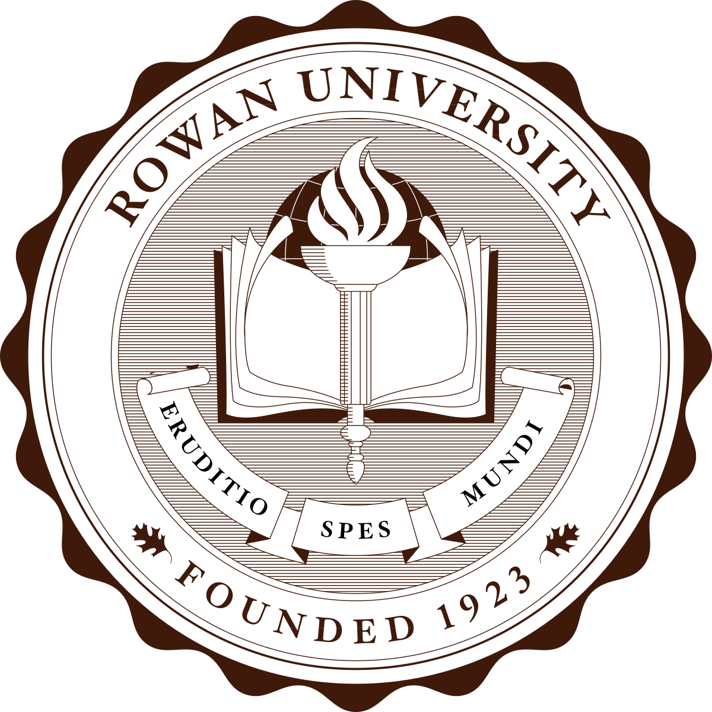

## Award

Service Award in IEEE International Conference on Mobile Ad hoc and Sensor Systems (MASS), 2019

Best Paper Award in IEEE CloudCom, 2016

NSF Student Travel Grant, IEEE International Conference on Mobile Ad hoc and Sensor Systems
(MASS), 2015

NSF Student Travel Grant, IEEE International Conference on Big Data, 2015

Harris Outstanding Researcher Award, Department of ECE, Clemson University, 2014

Honorable Mention of Interdisciplinary Contest in Modeling (ICM), 2008

## Grant

## Sponsor

{:height=20}

