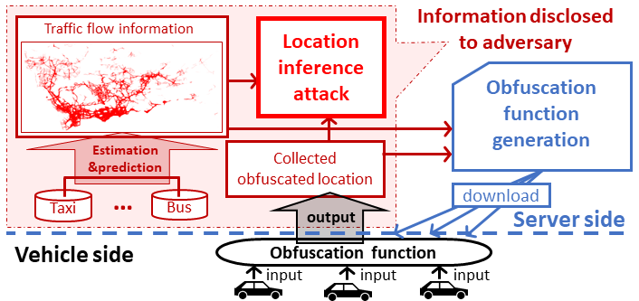

Vehicle Loction Privacy Protection in Location-based Services
------
{:height="50%" width="50%"}
Location obfuscation, which allows mobile users to report obfuscated locations instead of the exact locations, has been a dominating location privacy protection paradigm in many location-based services. Yet, the current obfuscation designs fail to address the vulnerabilities of vehicles, of which the mobility is restricted by the underlying road networks and traffic conditions. Particularly, individual vehicles’ mobility is restricted by various road environments, including local road network topology, speed limits, and traffic conditions. Built upon this insight, in this project, our objective is to 1) demonstrate that, with the road network environment and historical traffic flow information provided, vehicles’ trajectory can be inferred with high accuracy even their reported locations have been obfuscated, 2) propose a new location obfuscation paradigm to protect vehicles' location privacy considering the vehicles' mobility features over roads, and 3) develop, deploy, test, and refine the geo-obfuscation methods in dynamic location-based applications.

------
* Selected Publications: 
  * C. Qiu, A. C. Squicciarini, Z. Li, C. Pang, and L. Yan, Time-Efficient Geo-Obfuscation to Protect Worker Location Privacy over Road Networks in Spatial Crowdsourcing, in Proc. of The 29th ACM International Conference on Information and Knowledge Management (CIKM), 2020. 
  * A. Sarker, C. Qiu, H. Shen, H. Uehara, and K. Zheng, [Brake Data-Based Location Tracking in Usage-Based Automotive Insurance Programs](https://ieeexplore.ieee.org/document/9111047), in Proc. of The 19th ACM/IEEE Conference on Information Processing in Sensor Networks (IPSN), 2020.
  * C. Qiu and A. C. Squicciarini, [Location Privacy Protection in Vehicle-Based Spatial Crowdsourcing via Geo-Indistinguishability](https://ieeexplore.ieee.org/abstract/document/8885076), in Proc. of The 39th IEEE International Conference on Distributed Computing Systems (ICDCS), 2019.
